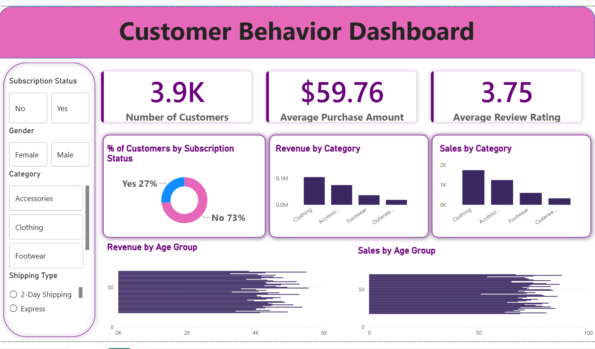

# 🛍️ Customer Shopping Behavior Analysis
An end-to-end **Data Analytics project** that analyzes customer shopping behavior using **Python, PostgreSQL/SQL, and Power BI**.
The project analyzes **3,900 customer purchases** across different product categories to uncover spending patterns, customer segments, product preferences, discount behavior, subscription trends, and purchasing patterns.
---

# 📊 Dashboard Preview



---

# 📌 Project Overview

This project analyzes transactional customer shopping data to identify meaningful business insights related to customer spending, product preferences, discounts, subscriptions, shipping methods, and customer loyalty.

The project follows an end-to-end analytics workflow:

**Python → Data Cleaning & Feature Engineering → PostgreSQL → SQL Analysis → Power BI Dashboard**

---

# 📊 Dataset

The dataset contains:

- **3,900 rows**
- **18 columns**

### Key Data Categories

**Customer Demographics**
- Age
- Gender
- Location
- Subscription Status

**Purchase Details**
- Item Purchased
- Category
- Purchase Amount
- Season
- Size
- Color

**Shopping Behavior**
- Discount Applied
- Previous Purchases
- Frequency of Purchases
- Review Rating
- Shipping Type

---

# 🐍 Python Data Analysis

Python was used for data preparation, cleaning, exploration, and feature engineering.

### Data Preparation

- Loaded the dataset using Pandas
- Performed initial data exploration using `df.info()` and `df.describe()`
- Checked for missing values
- Handled missing Review Rating values using the median rating of each product category
- Standardized column names to snake_case
- Removed the redundant `promo_code_used` column

### Feature Engineering

Created:

- `age_group`
- `purchase_frequency_days`

The purchase frequency values were converted into equivalent numbers of days for analysis.

---

# 🗄️ PostgreSQL & SQL Analysis

The cleaned dataset was loaded into PostgreSQL for structured business analysis.

SQL was used to answer key business questions such as:

- Revenue by Gender
- High-Spending Discount Users
- Top 5 Products by Rating
- Standard vs Express Shipping Comparison
- Subscribers vs Non-Subscribers
- Discount-Dependent Products
- Customer Segmentation
- Top 3 Products per Category
- Repeat Buyers & Subscription Behavior
- Revenue by Age Group

---

# 📈 Customer Segmentation

Customers were classified into three segments based on purchase history:

- **New**
- **Returning**
- **Loyal**

This segmentation helps identify customer groups with different purchasing behaviors.

---

# 📊 Power BI Dashboard

An interactive Power BI dashboard was created to visually present the analyzed data and business insights.

The dashboard focuses on:

- Customer spending behavior
- Product performance
- Customer segments
- Subscription behavior
- Discount usage
- Purchase trends
- Revenue analysis

---

# 💡 Business Recommendations

Based on the analysis, several business recommendations were identified:

### 1. Boost Subscriptions

Promote exclusive benefits and incentives for subscribers.

### 2. Customer Loyalty Programs

Reward repeat buyers and encourage them to move into the **Loyal** customer segment.

### 3. Review Discount Policy

Balance discount-driven sales growth with profitability and margin control.

### 4. Product Positioning

Highlight highly rated and best-selling products in marketing campaigns.

### 5. Targeted Marketing

Focus marketing efforts on high-revenue age groups and customers using express shipping.

---

# 🛠️ Tools & Technologies

- **Python**
- **Pandas**
- **NumPy**
- **Matplotlib**
- **Seaborn**
- **PostgreSQL**
- **SQL**
- **SQLAlchemy**
- **Power BI**
- **Power Query**
- **DAX**

---

# 📂 Project Files

| File | Description |
|------|-------------|
| `Customer_Shopping_Behavior_Analysis.ipynb` | Python data cleaning, exploration and feature engineering |
| `customer_behavior_queries.sql` | SQL queries used for business analysis |
| `Customer_Behavior_Dashboard.pbix` | Power BI interactive dashboard |
| `customer_shopping_behavior.csv` | Original dataset |
| `customer_behavior_dashboard.png` | Power BI dashboard preview |
| `README.md` | Project documentation |

---

# 🔄 Project Workflow

```text
Customer Shopping Data
        ↓
Python / Pandas
        ↓
Data Cleaning
        ↓
Feature Engineering
        ↓
PostgreSQL
        ↓
SQL Business Analysis
        ↓
Power BI
        ↓
Interactive Dashboard
        ↓
Business Insights & Recommendations
```

---

# 💡 Skills Demonstrated

- Data Cleaning
- Exploratory Data Analysis
- Data Transformation
- Feature Engineering
- SQL Querying
- PostgreSQL
- Database Integration
- Customer Segmentation
- Business Analysis
- KPI Development
- Power BI
- Data Visualization
- Business Intelligence

---

# ▶️ How to Use

### 1. Clone the Repository

```bash
git clone https://github.com/yourusername/customer-shopping-behavior-analysis.git
```

### 2. Open the Python Notebook

Open:

```text
Customer_Shopping_Behavior_Analysis.ipynb
```

using Jupyter Notebook, JupyterLab, or Google Colab.

### 3. Add the Dataset

Make sure:

```text
customer_shopping_behavior.csv
```

is available in the notebook environment.

### 4. Run the Python Analysis

Run the notebook cells to perform:

- Data exploration
- Data cleaning
- Missing value handling
- Feature engineering
- PostgreSQL integration

### 5. Run the SQL Analysis

Open:

```text
customer_behavior_queries.sql
```

and execute the queries in PostgreSQL/pgAdmin.

### 6. Open the Power BI Dashboard

Open:

```text
Customer_Behavior_Dashboard.pbix
```

using Microsoft Power BI Desktop.

---

# 🎯 Business Use Cases

This analysis can support:

- Customer Segmentation
- Marketing Strategy
- Product Recommendations
- Customer Retention
- Subscription Growth
- Discount Strategy
- Revenue Analysis
- Product Performance Analysis
- Shipping Strategy

---

# 👨‍💻 Author

**Gururaj V**

Information Science Graduate

**Skills:** Python • SQL • PostgreSQL • Power BI • Excel • Data Analytics

